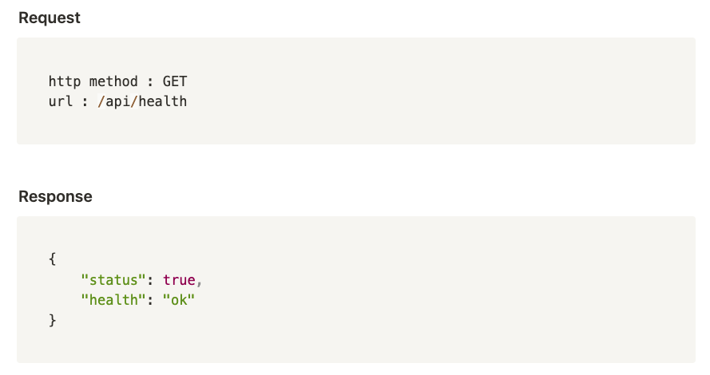
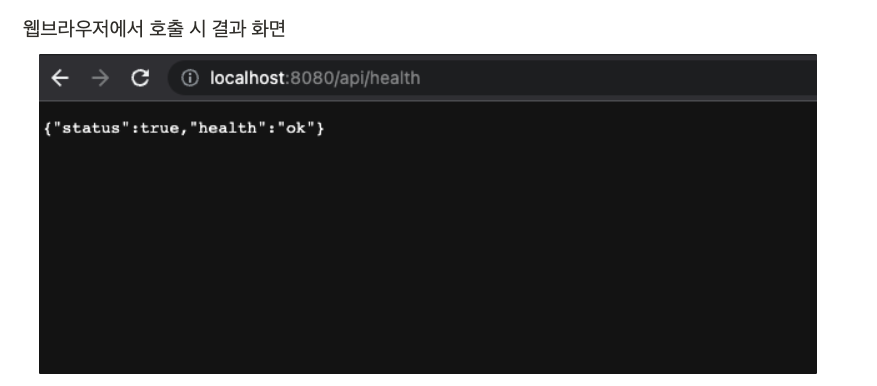
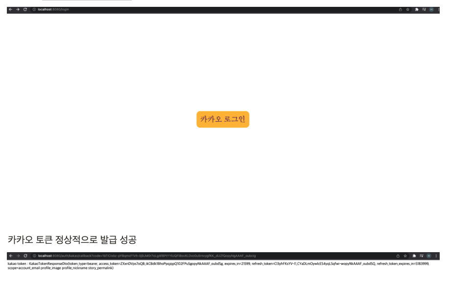
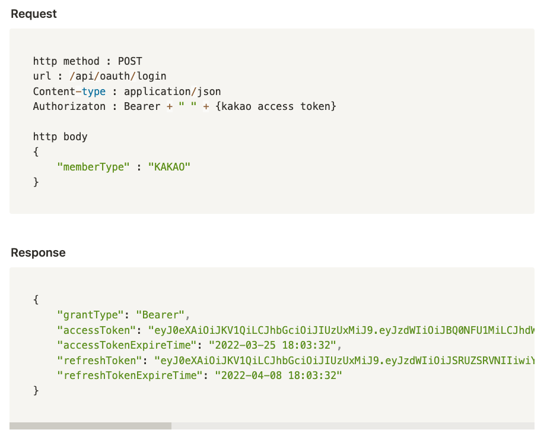
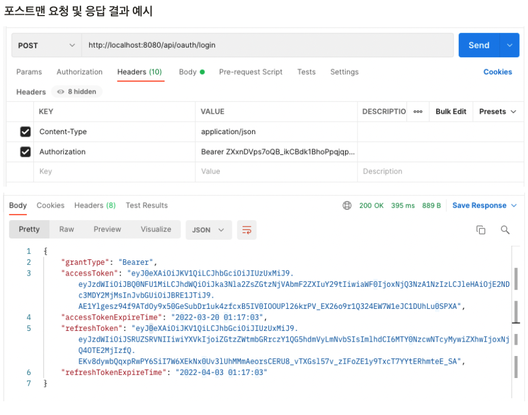
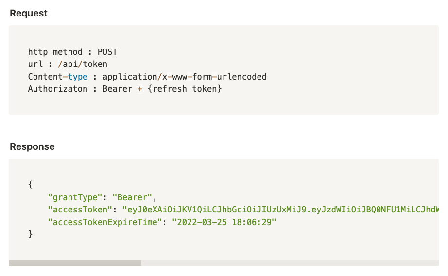
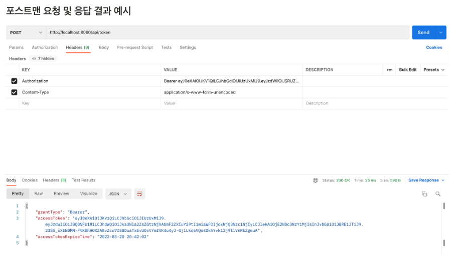
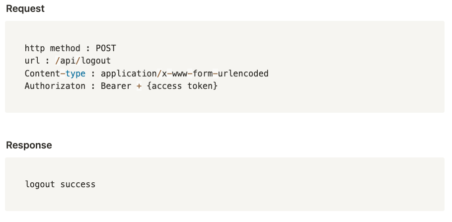
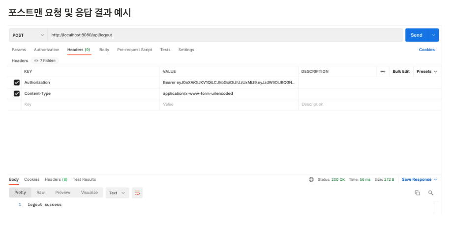
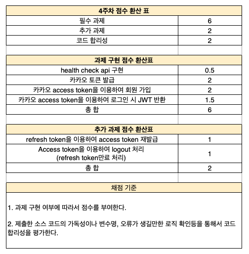

# 4주차 : 쇼핑몰 API 서버 인증 구현

## 주의사항

```
[공지] 자료 유출에 대한 알림

녹화 및 유포, 복제 등이 발생하는 경우 본 익스턴십 참여부터, 관련된 모든 법적제재의 대상이 될 수 있으므로 본 자료는 과제수행용으로만 이용 가능 하시다는 것 유념 부탁드리겠습니다.

감사합니다.
```

## 학습 목표
- 1~3주차까지 진행했던 domain 핵심 로직 재활용
- API 서버에서 에러 처리 전략 이해
- API 서버에서 소셜 회원 가입 구현 (카카오 로그인)
- API 호출을 위한 JWT 기반 인증 구현

## 미션
- health check api 구현
- 카카오 TOKEN 발급 구현
- 발급 받은 카카오 Access Token을 이용하여 회원 가입 및 로그인 진행
  - 로그인 성공 시 반환 값으로 JWT 반환 (엑세스 토큰, 리프레시 토큰)
- refresh token을 이용하여 access token 재발급
- access token을 이용하여 logout 처리 (refresh token 만료 처리)

## 기능 구현 요구 사항
1. health check api 구현› (필수 과제)
  
  

2. 카카오 토큰 발급 (필수 과제)
- http://localhost:8080/login
- 카카오 로그인 버튼 클릭 시 카카오 로그인 페이지 이동 및 로그인 성공 시 카카오 토큰 발급
- [카카오 개발자센터](https://developers.kakao.com/)
  

3. 회원 가입 진행 (필수 과제)
- 발급 받은 카카오 access token을 이용하여 카카오 회원 정보를 불러와서 회원 가입 진행
- 정상적으로 회원 가입 or 회원 가입 후 다시 로그인 시 access token, refresh token 반환
- Bearer 뒤에는 공백을 한칸 추가합니다.
- http 요청 툴 : postman (기존에 다른 프로그램을 사용하시던게 있으시면 해당 프로그램을 사용하셔도됩니다.)
  
  
  

4. refresh token을 이용하여 access token 재발급 (추가 과제)
  
  


5. access token을 이용하여 logout 처리 (refresh token 만료 처리) (추가 과제)
  
  

## 평가 기준
